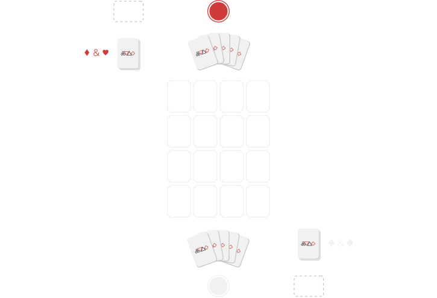
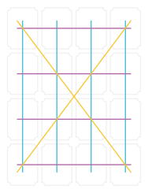
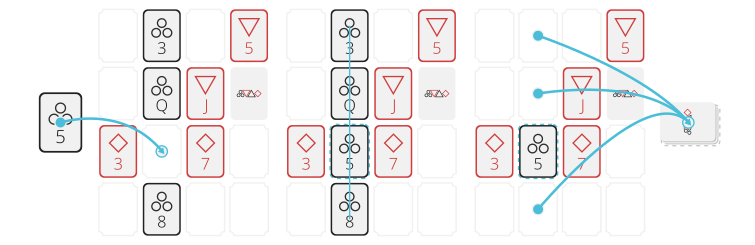
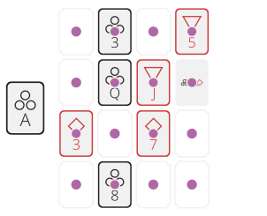
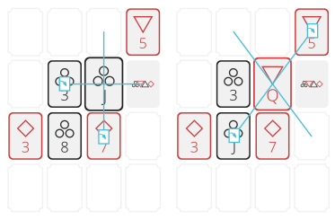
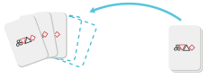

# Gomori

Gomori is a *2 Player* Tactical-Card-Game played with a default 52-Card-Deck influenced by _Connect 4_, _Reversi_ and _Triple Triad_.

## Setup

  
  
<i>Figure 1: The playing field.</i>

- The 52-Card-Deck is *split into two* 26-Card-Decks by color -- one deck containing the *black suits*
  (clubs (♣), and spades (♠)),
  the other one containing the *red suits* (diamonds (♦) and
  hearts (♥)). Each player plays their own deck.
- The game is played on a loosely defined *4x4 field* (as long as there are no 4 fields in an axis,
  the field can be extended in either direction).
- Each player draws *5 cards* from their deck -- the remaining cards are used as draw pile.
- The player playing the black suits begins.
- Gathered cards of each player are placed upside down clearly distiguishable on the respective players side of the field.

## Goal

The player with the most gathered cards wins.

## Rules

### Gathering Cards

  
  
<i>Figure 2: Rows, columns, and diagonals of the playing field.</i>

- If *four cards of same suit* lie in one _row_,
  _column_ or _diagonal_ line,
  the player who just laid the fourth one *takes the cards* (including stacks)
  *except the one laid last* (including its stack) and stacks them face-down on their gathered cards stack.

  
  
<i>Figure 3: The five of clubs finishes the second column to be filled with all clubs.</i>

### Playing Cards

- *Number cards* (2-10) can be played on
  - empty fields,
  - face-down cards or
  - cards of the same rank -- regardless their suit.

  
  
<i>Figure 4: The five of clubs can be played on the empty fields, the five of hearts and the face-down card.</i>

- *Face cards* (jacks, queens, and kings) can be played on
  - empty fields,
  - face-down cards,
  - cards of the same rank -- regardless their suit -- or
  - cards of the same suit

Always, When *face cards* are played on other cards (regardless if face-up or face-down) they get activated. See [Activating Face Cards](#activatingface-cardsandturningcardsface-down).

  
  
<i>Figure 5: The jack of clubs can be played on the empty fields, the jack of hearts, the face-down card and also all other cards of clubs.</i>

- *Aces* can be played everywhere -- on
  - empty fields,
  - face-down cards
  - cards of any rank and suit.

  
  
<i>Figure 6: Aces can be played everywhere.</i>

### Activating Face-Cards and Turning Cards Face-Down

Face Cards have each an additional effect, that gets activated when played on another card.
These effects have to be executed and are executed _before_ any other action including gathering cards.

  
  
<i>Figure 7: The Jack turns horizonally and vertically, the Queen diagonally. Already turned face-down cards are not turned face-up again.</i>

- The Jacks: All face-up cards lying horizontally and vertically next to the jack are turned face-down
- The Queens: All face-up cards lying diagonally next to the queen are turned face-down
- The Kings: One card anywhere on the field by the current players choice is turned face-down -- the king itself can also be chosen

### Playing more cards

  
  
<i>Figure 8: The five of clubs is stacked onto a face down card, so another card has to be played.</i>

- Always when one cards is stacked on top of another card, the current player plays another card if possible
- This is chained until either
  - a card is played on an empty field or
  - the player has no more cards on their hand or
  - the player has no legal move left to play another card.
- If a line of four is completed by stacking one card on top of another, the other three cards of the line are taken _before_ the current player plays the next card.

### End of turn

  
  
<i>Figure 9: The hand is filled up to five cards.</i>

- If no more cards can or may be played the players turn ends.
- At the end of turn the player fills up their hand to the amount of five cards from their draw pile.

### End of game

  
  
<i>Figure 10: The hand cannot be filled up to five cards. The game ends immediately.</i>

- If the current player cannot fill up their hand at the end of turn for the draw pile being empty, the game ends immediately and the gathered cards are counted for each player.
- The game also ends, if both players cannot play any card in consecutive turns.

## Trivia

The name of the game comes from combining the words _Go_ and _Memory_, as the first version of the game had elements of both of them. Though all these gameplay-elements have been removed from the game at later stages, the name stayed the same.

## Version and License
- Version 1.0.2
- CC-BY-SA-4.0, Philipp Wittershagen
